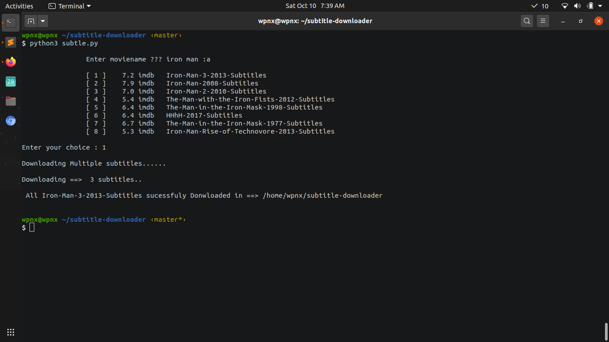

# subtitle-downloader

## Subtitle Downloader- downloads the subtitle of movie. Without opening browser.You just need to provide movie name. ##

## Requirement Python3.6 or above ##

##### pip install -r requirements.txt #####
>FOR DOWNLOADING ALL SUBTITLES OF MOVIE ADD " :a " AFTER MOVIE NAME TO DOWLOAD ALL SUBTITLES OF MOVIE #####

    eg. Enter moviename ??? Avengers :a

>FOR DOWNLOADING ONLY SINGLE SUBTITLE OF MOVIE(HIGEST RATED) DONT ADD ANYTHING AFTER MOVIE NAME , SO PROGRAM WILL DOWNLOAD THE SINGLE SUBTITLE OF MOVIE 

